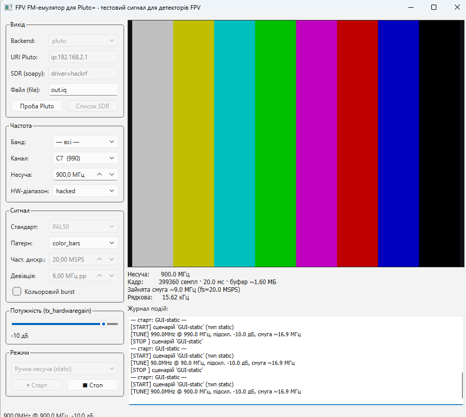

# FPV FM-емулятор для Pluto+

Генератор тестового **аналогового FPV-відеосигналу з ЧМ-модуляцією** на базі SDR
**ADALM-Pluto+**. Формує реалістичне композитне відео (кольорові тестові таблиці),
частотно модулює ним несучу й випромінює в ефір — щоб перевіряти роботу **детекторів
аналогового FPV** за різними діапазонами, каналами, потужностями та сценаріями (свіп
по діапазонах, рамп потужності, кілька «дронів» одночасно) або вручну.



> Це **стендовий генератор тестового сигналу**. Веде передачу в радіоефір —
> використовуйте лише в екранованому середовищі / на дозволених частотах, з
> відповідними погодженнями. Відповідальність за роботу в ефірі — на операторі.

---

## Завантаження (без git і терміналу)

1. **[⬇ Завантажити ZIP](https://github.com/Zapadenec1982/fpv-fm-emulator/archive/refs/heads/main.zip)**
   (або на сторінці репозиторію: зелена кнопка **Code** → **Download ZIP**).
2. **Розпакувати** архів у зручну папку (напр. `C:\Projects\fpv-fm-emulator`).
   ⚠️ Саме розпакувати — запускати з середини ZIP не можна.
3. Далі — два кліки: `setup.bat`, потім `run_gui.bat` (див. нижче).

**Потрібен Python 3.9+** — якщо ще немає, встановіть з
[python.org](https://www.python.org/downloads/) і **обов'язково відзначте
«Add python.exe to PATH»** у першому вікні інсталятора.

Якщо користуєтесь git:
```bash
git clone https://github.com/Zapadenec1982/fpv-fm-emulator.git
```

---

## Що воно робить

Реальний аналоговий FPV-передавач частотно модулює несучу композитним відео з
камери. FPV-детектор приймає це ЧМ-відео й виявляє присутність дрона. Емулятор
відтворює саме такий сигнал:

```
кольорова тест-таблиця → композитне відео (CVBS, PAL50/NTSC60) → ЧМ → IQ → Pluto TX
```

**Важливо (перевірено на реальному детекторі):** детектор дивиться не лише на
потужність (RSSI), а на **профіль модуляції**. Тому за замовчуванням генерується
**реалістичний FPV-профіль** — кольорові смуги з піднесучою 4.43 МГц + широка ЧМ,
зайнята смуга ~17 МГц, як у справжнього VTX. Вузький ч/б давав високий RSSI, але
розпізнавався погано.

---

## Архітектура

Ядро не залежить від апаратури — його можна запускати й тестувати офлайн.

```
fpv_emulator/
  bands.py        таблиці діапазонів/каналів + guard за межами HW
  video.py        композитне відео (PAL50/NTSC60), люма + кольорові патерни, хрома
  fm.py           ЧМ-модуляція baseband → IQ, конверсія в int16
  signal_gen.py   відео+ЧМ → кадровий (циклічний) IQ; мультидрон
  backends.py     приймачі IQ: Pluto (pyadi-iio) | soapy (HackRF/Lime/…) | file | null
  scenarios.py    рушій сценаріїв (static/sweep+pause/power_ramp/multi_drone), жива потужність
  config.py       завантаження/валідація YAML-сценаріїв
  probe.py        визначення чипа й меж перестроювання Pluto
  cli.py          командний інтерфейс
gui/app.py        десктоп-GUI (PySide6): ручне керування + сценарії + прев'ю
config/
  bands.yaml      частоти каналів (редаговані)
  scenarios/*.yaml приклади сценаріїв
scripts/probe_pluto.py   автономна проба апаратури
tests/            офлайн-тести ядра (pytest, 30 шт.)
```

---

## Встановлення та запуск (Windows — два кліки)

**Головний інструмент — GUI.** Термінал для роботи не потрібен:

1. **`setup.bat`** — подвійний клік **один раз**. Створить оточення `.venv` і поставить
   усе потрібне (numpy, PySide6, pyadi-iio…).
2. **`run_gui.bat`** — подвійний клік, щоб **запустити GUI**. Відкриється головне
   вікно (помилки старту, якщо є, покаже діалог).

> Порада: правий клік на `run_gui.bat` → створити ярлик на робочому столі / закріпити
> на панелі задач — і запуск буде в один клік.

### GUI — що всередині

Відкривається одразу з робочим профілем (color_bars, 20 MSPS, PAL50, backend
`pluto`). Усе керується мишкою:
- **Вихід:** backend (`pluto` / `soapy` для HackRF та ін.), URI/пристрій, кнопки
  «Проба Pluto» і «Список SDR».
- **Частота:** банд/канал або несуча вручну.
- **Сигнал:** стандарт, патерн (прев'ю в кольорі), частота дискретизації, девіація.
- **Потужність:** повзунок, **міняється в рантаймі** під час передачі.
- **Режим:** ручна несуча або готовий сценарій; Старт/Стоп; журнал подій.

Для передачі: оберіть backend `pluto` (або `soapy`), частоту → **Старт**.

---

## Термінал (CLI) — лише для автоматизації

GUI покриває щоденну роботу; CLI зручний для скриптів. Запуск — через `.venv`:

```bash
.venv\Scripts\python.exe -m fpv_emulator.cli probe
.venv\Scripts\python.exe -m fpv_emulator.cli tx --backend pluto --scenario sweep_ranges
.venv\Scripts\python.exe -m fpv_emulator.cli tx --backend pluto --freq-mhz 1200 --pattern color_bars --gain 0
.venv\Scripts\python.exe -m fpv_emulator.cli gen --pattern color_bars --sample-rate 20e6 --out frame.iq
.venv\Scripts\python.exe -m fpv_emulator.cli list-bands   # також list-patterns | list-scenarios | list-devices
```

Ручне встановлення (замість `setup.bat`):
```bash
python -m venv .venv
.venv\Scripts\activate
pip install -r requirements.txt -r requirements-hw.txt
```
Нативна **libiio** має бути в системі (Linux: `apt install libiio0 libiio-utils`).

---

## Відеостандарти й патерни

**Стандарти:** `PAL50` (312 рядків, 50 Гц поля) і `NTSC60` (262 рядки, 60 Гц) —
прогресивні 288p/240p. Саме частота полів 50/60 Гц (а не 25/30) прибирає
вертикальний зсув картинки на моніторі детектора. Старі імена `PAL`/`NTSC`
автоматично мапляться на `PAL50`/`NTSC60`.

**Люма-патерни (ч/б):** `bars`, `smpte75`, `ramp`, `crosshair`, `grid`, `checker`,
`multiburst`, `white`, `gray`, `black`.

**Кольорові патерни (реалістичний FPV):** `color_bars` (75%), `color_bars100` —
з піднесучою 4.43 МГц (PAL) / 3.58 МГц (NTSC), burst і чрома-модуляцією. Потребують
`fs ≥ ~13 MSPS` (у GUI піднімається автоматично до 20).

---

## Сценарії (YAML)

Спільний блок `signal:` (standard, pattern, sample_rate, deviation_pp_hz, gain_db),
далі блок за типом. Приклади — у `config/scenarios/`.

| Тип | Призначення |
|-----|-------------|
| `static` | одна несуча (channel/freq_mhz, hold_s) |
| `sweep` | перебір каналів/**діапазонів з кроком** (`ranges`), з опційною **паузою** (`pause_s`) |
| `power_ramp` | наближення/віддалення дрона (start_db→end_db, mode: up/down/pingpong) |
| `multi_drone` | кілька несучих одночасно (drones[{pattern, offset_mhz, level_db}]) |

Свіп за діапазонами:
```yaml
sweep:
  ranges:
    - { start_mhz: 5650, stop_mhz: 5950, step_mhz: 20 }   # напр. 5.8 ГГц FPV
  dwell_s: 15    # передача на частоті
  pause_s: 5     # тиша (RF off) між частотами
```

---

## Як це працює (DSP)

1. **Композитне поле** (`video.py`): один період поля 288p/240p із коректним
   таймінгом рядків і вертикальним синхро (50/60 Гц). Для кольору додається
   піднесуча + burst + чрома (U/V; для PAL — перемикання фази V по рядках).
2. **ЧМ** (`fm.py`): `iq = exp(j·2π·∫ dev·v dt)`. Центрування (віднімання середнього)
   забезпечує фазову неперервність на стику циклічного буфера.
3. **Циклічний буфер**: одне поле вантажиться як `tx_cyclic_buffer` і повторюється
   в пристрої. Зміна частоти/потужності — на льоту; зміна патерну — перезаливка.
4. **Жива потужність**: слайдер у GUI кладе значення, а робочий потік застосовує
   `tx_hardwaregain` (libiio чіпається лише з одного потоку).

**Найквіст:** пікова екскурсія `±девіація/2` (+зсуви мультидрону) має бути < `fs/2`,
інакше сигнал завертається (є попередження).

---

## Апаратні нотатки (Pluto+)

| Тип | Чип | Діапазон | 5.8 ГГц |
|-----|-----|----------|---------|
| Стоковий | AD9363 | 325 МГц – 3.8 ГГц | лише через ап-конвертер |
| AD9361-мод | AD9361 | 70 МГц – 6.0 ГГц | напряму |

На **5.8 ГГц вихід Pluto слабший** (плата розрахована ~до 3.8 ГГц) — широкий сигнал
там може бути на межі. На нижчих смугах (1–3 ГГц) вихід сильний.

---

## Підтримувані SDR

Ядро генерує IQ незалежно від апаратури; передавальний бекенд обирається прапорцем
`--backend` (CLI) або у GUI.

| Backend | Пристрої | Примітки |
|---------|----------|----------|
| `pluto` | ADALM-Pluto / Pluto+ | нативно (pyadi-iio/libiio), циклічний буфер у пристрої |
| `soapy` | **HackRF, LimeSDR, BladeRF, USRP**, Pluto та ін. | через SoapySDR; хост безперервно ллє кадр |
| `file` | будь-який (офлайн) | запис IQ у `.iq`/`.npy` |
| `null` | — | сухий прогін без ефіру |

SoapySDR-приклади:
```bash
python -m fpv_emulator.cli list-devices                       # знайти підключені SDR
python -m fpv_emulator.cli tx --backend soapy --device driver=hackrf --freq-mhz 5800 --gain 0
python -m fpv_emulator.cli tx --backend soapy --device driver=lime --scenario sweep_ranges
```
У GUI: backend `soapy`, у полі «SDR (soapy)» — `driver=hackrf|lime|uhd|bladerf`,
кнопка «Список SDR» покаже доступні. Потужність (слайдер −89..0, 0 = макс)
автоматично мапиться на реальний діапазон підсилення пристрою.

**Нюанси:** HackRF — 8 біт, напівдуплекс, макс ~20 MSPS, немає апаратного циклічного
буфера (хост крутить кадр). Дешеві RTL-SDR-донгли **передавати не вміють** (тільки
прийом). Діагностики через RX (проба, RX-самоприйом) — специфічні для Pluto.
Встановлення SoapySDR — див. `requirements-hw.txt` (pip його не ставить).

---

## Тести
```bash
python -m pytest tests/ -q
```
30 офлайн-тестів (без апаратури): пошук каналів, HW-guard, таймінг/рівні відео,
кольорова піднесуча, ЧМ, мультидрон, попередження про аліасинг, димові прогони
рушія (sweep/pause/power_ramp/multi_drone), жива потужність.

---

## Ключові висновки
- **RSSI ≠ якість прийому.** Детектор дивиться на профіль модуляції → реалістичний
  широкий кольоровий сигнал розпізнається, вузький ч/б — ні, попри високий RSSI.
- Кадрова **50/60 Гц полів** (не 25/30) — обовʼязкова для правильної вертикальної
  синхронізації на моніторі детектора.

---

## Ліцензія

Не задано. Додайте файл `LICENSE` на свій розсуд (напр. MIT), перш ніж поширювати.
